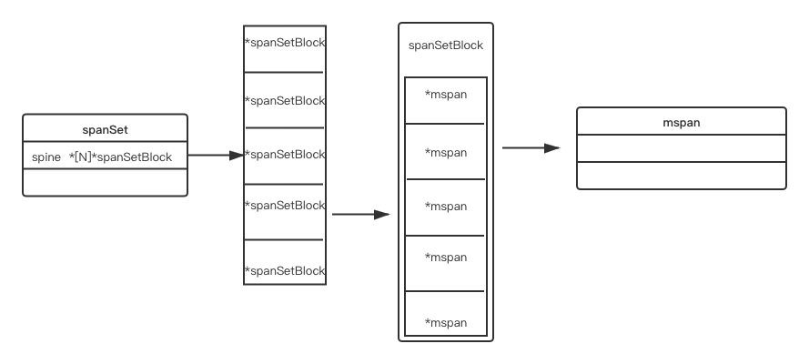

# 问题
- spanSet缓存的作用是什么？

# spanSet结构
 

## 说明
- spanSet的spine字段是一个*[N]*spanSetBlock类型；
- spanSetBlock中有一个spans字段 ，是一个[512]\*mspan类型的指针数组，占用空间为2^9*2^3=4KB;

# headTailIndex结构
## 说明
- 该结构是一个uint64类型，前32bit表示head，后32bit表示tail，最多可以表示2^32个元素；

# spanSet操作函数
## push操作
> 将mspan插入spanSet缓存  
- step1：以512为一组，划分spanSetBlock;
- step2: tail/512为top，表示取第几个spanSetBlock，取值: b.spine+sys.PtrSize*top；
- step3: tail%512为bottom，表示单个spanSetBlock中，选择第几个slot;

# spanSetBlockPool
> spanSetBlockPool是一个lfstack，lfstack是一个链表结构的stack，每个元素为一个spanSetBlock;
> 如果spanSetBlockPool为空，则调用persistentalloc去获取，该函数最终调用mmap系统调用从OS堆中获取；
> 每次获取一个spanSetBlock，大小512*2^3约4KB的空间，共可存储512个mspan地址；
## 操作
> spanSetBlockPool有alloc和free两个操作；
> alloc首先从spanSetBlockPool获取spanSetBlock，没有在从系统分配；
> 回收时，会将spanSetBlock push到spanSetBlockPool中；
